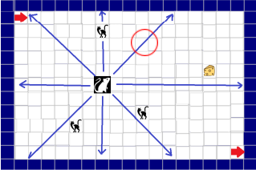

# Intelligent_models_project

## Project: Mouse, Cat, and Cheese Simulation

The **Mouse, Cat, and Cheese Simulation** project explores the interaction dynamics between two classes of agents — **Mice** and **Cats** — within a controlled environment containing pieces of **Cheese**.

### Environment

- The environment consists of an `m x n` grid-based space.
- A predefined number of **Mice** (`M`), **Cheese** pieces (`H`), and **Cats** (`C`) are randomly placed on the grid at initialization.

### Attraction and Repulsion Dynamics

- **Cats** exhibit attraction towards **Mice** within their vision range `ρ`.
- **Mice** are repelled by **Cats** and attracted to **Cheese** within their vision range `ρ`.
- Attraction and repulsion forces are modeled through mathematical functions that depend on the distance between agents. Repulsion is amplified by a multiplicative factor `β ≥ 1`.

### Simulation & Data Collection

#### Agent Movement Rules:

- Both **Mice** and **Cats** move in one of eight possible directions (vertical, horizontal, or diagonal).
- Border movements simulate a convex space.

**Mouse Behavior:**

1. Identify the most attractive cheese piece within range.
2. Identify the most repulsive cat within range.
3. Move based on the dominant attraction/repulsion force (repulsion takes priority in case of ties).
4. Adjust position to either minimize distance to cheese or maximize distance from cats.
5. Upon reaching a cheese piece, the mouse relocates randomly to an empty cell.

**Cat Behavior:**

1. Identify the most attractive mouse within range.
2. Move based on attraction strength (break ties randomly).
3. Adjust position to minimize distance to the targeted mouse.

#### Environment Parameters:

- Grid dimensions: `m, n`
- Number of agents: `C` (Cats), `M` (Mice), `H` (Cheese)
- Vision range: `ρ`
- Repulsion factor: `β`
- Random seed for reproducibility
- Simulation steps per run: `K`
- Number of runs: `T`

#### Data Collection:

- Agent movements and positions are tracked and logged at each step.
- Each agent's trajectory is recorded across `T` runs of `K` steps.
- The output data is saved in a CSV format for analysis.
- A visual representation showcases agent movement dynamics with distinct colors for **Cats**, **Mice**, and **Cheese**.

### Data Mining & Machine Learning

Using the dataset generated from the simulation phase, this stage applies data mining techniques — either **clustering** or **classification** — to differentiate between **Cats** and **Mice** based on their movement patterns.

#### Workflow:

1. Load the simulation output dataset.
2. Process and extract relevant features.
3. Split data into **Training** and **Test** sets.
4. Apply clustering/classification algorithms.
5. Evaluate algorithm performance.

#### Performance Metrics:

- **Accuracy**
- **Precision**
- **Recall**
- **F1 Score**
- **Confusion Matrix**

### Project Goals

This project aims to:

- Simulate and visualize agent interactions in a dynamic grid environment.
- Generate structured datasets from agent behaviors.
- Apply data mining techniques to classify agent types effectively.
- Evaluate the performance of the applied models using standard metrics.

The **Mouse, Cat, and Cheese Simulation** provides a foundation for studying complex agent-based systems and applying data analysis techniques to interpret behavioral patterns.
